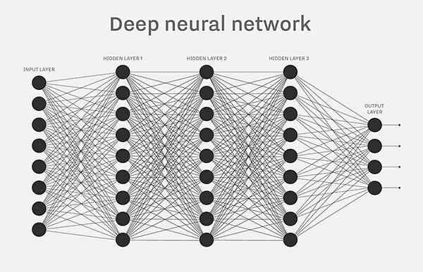

本文作者：[gerry] # 概要：本文以org.deeplearning4j.nn.layers.BaseLayer为例，DenseLayer继承BaseLayer，并使用其前向与反向传播方法。
<!-- more -->

# dl4j的BaseLayer前向与反向传播算法计算过程简介

本文以org.deeplearning4j.nn.layers.BaseLayer为例，DenseLayer继承BaseLayer，并使用其前向与反向传播方法。DenseLayer的网络结构如下图所示。

----------



​	

1.前向传播
------

BaseLayer的前向传播计算过程方法为preOutput(boolean training)，其中与公式 Z=WX + b对应的代码为：
	

```
INDArray ret = input.mmul(W).addiRowVector(b);
```

假设某一层的输入值为nIn，输出值为nOut，每次使用的样例个数为batchSize。

input的shape为(batchSize,nIn)
W的shape为(nIn,nOut)
b的shape为(1,nOut)
Z和WX的shape都为(batchSize,nOut)

addiRowVector方法是计算得到WX的结果后每一行加上b，其实可以理解为Z=WX+B*b，其中B为偏置向量b的系数，shape为(batchSize,1)，其所有值都为1。为何在此处提到系数矩阵B，方便解释在反向传播中对偏置的偏导数是如何计算。

激活函数a=activation(Z)，a的shape是(batchSize,nOut)，这里先定义一个activationDerivative(Z)是激活函数的导数。
	
	

2.反向传播
------

主要的方法是BaseLayer.backpropGradient(INDArray epsilon)。


如上图，注释中已经解释epsilon是代价函数(损失函数)C对激活函数a的偏导，并且是对当前隐藏层的激活函数的偏导。
	
然后计算delta=(dC/dZ)=(dC/da)*(da/dZ)=epsilon⊙activationDerivative(Z)，⊙为hadamard积分，代码为：
				

```
INDArray delta = layerConf().getActivationFn().backprop(z, epsilon).getFirst();
```

计算weightGrad=dC/dW=(dC/dZ)(dZ/dW)=delta *  input^T，代码：
				

```
Nd4j.gemm(input, delta, weightGrad, true, false, 1.0, 0.0);
```

计算biasGrad=dC/db=(dC/dZ)(dZ/db)=delta * B^T，这个B矩阵在上面已经提到过，shape为(batchSize,1)，所有的值都为1，所以相当于：
				

```
delta.sum(biasGrad, 0);
```

最后......，首先设前一层的激活函数矩阵为A，掐脚趾一算不正是当前层的input矩阵么，所以要传递给前一层的epsilonNext=dC/dA=(dC/dZ)(dZ/dA)=(dC/dZ)(dZ/d(input))=delta * W^T，代码为:

```
INDArray epsilonNext = params.get(DefaultParamInitializer.WEIGHT_KEY).mmul(delta.transpose()).transpose();
```

以上为本人个人见解，如有错误，请网友们批评指正。